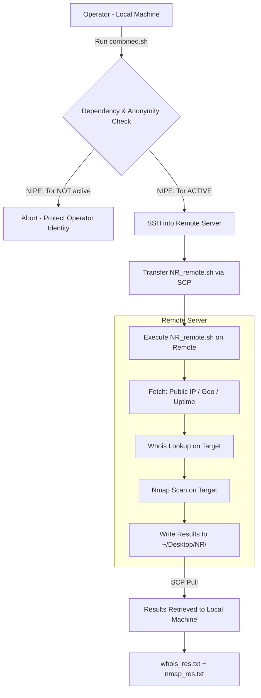

# **Network Research Automation**

> Automated, Tor-anonymized network reconnaissance via SSH-orchestrated local/remote script execution.

[](LICENSE)
[]()
[]()
[]()

---

## What It Does

**Network Research Automation** is a two-script reconnaissance framework that orchestrates network intelligence gathering across local and remote machines over an encrypted SSH tunnel.

**Key capabilities:**

- **Tor Anonymity Enforcement** — verifies all traffic is routed through the Tor network using NIPE before any scan begins
- **SSH-based Remote Execution** — securely deploys and runs the reconnaissance script on a remote Linux host
- **Whois Intelligence** — gathers domain/IP registration data, ownership, and registrar details
- **Nmap Port Scanning** — identifies open ports, running services, and OS fingerprints on the target
- **Automated Result Retrieval** — pulls all scan output back to the local machine for post-analysis

The tool is built entirely in Bash, requiring no external runtimes — only standard Linux tools.

---

## Tech Stack

| Layer | Technology |
|---|---|
| Scripting | Bash (POSIX-compatible) |
| Anonymity | [Tor](https://www.torproject.org/) + [NIPE](https://github.com/htrgouvea/nipe) |
| Remote Execution | SSH / `sshpass` |
| Reconnaissance | `nmap`, `whois` |
| Data Handling | `jq`, `curl` |
| OS | Linux (Ubuntu / Kali / Debian) |

---

## Architecture



---

## Setup

### Prerequisites

**Local machine** (Ubuntu / Kali / Debian):

```bash
sudo apt update && sudo apt install -y sshpass curl cpanminus git nmap tor jq openssh-client
```

**Remote server** (any Linux):

```bash
sudo apt update && sudo apt install -y openssh-server nmap whois
```

### Install NIPE (Tor Anonymity Verification)

```bash
git clone https://github.com/htrgouvea/nipe && cd nipe
sudo cpanm --installdeps .
sudo perl nipe.pl install
```

### Configure Environment

Copy `.env.example` to `.env` and fill in your values:

```bash
cp .env.example .env
```

```env
# Target to scan
TARGET_HOST=<domain or IP>

# Remote server SSH credentials
REMOTE_USER=<ssh_username>
REMOTE_HOST=<remote_server_ip>
# Use SSH key auth where possible — avoid storing plaintext passwords
SSH_PASS=<ssh_password_or_leave_blank>
```

> **Note:** Prefer SSH key-based authentication over password auth. Never commit `.env` to version control.

---

## Run

```bash
bash combined.sh
```

The script will interactively prompt for target and SSH details, verify Tor anonymity, deploy the remote script, execute scans, and retrieve results.

**Output files saved to `~/Desktop/NR/`:**

| File | Contents |
|---|---|
| `whois_res.txt` | Whois domain/IP registration data |
| `nmap_res.txt` | Nmap port scan report |

---

## Project Structure

```
network-research-automation/
├── combined.sh          # Local orchestration script
├── NR_remote.sh         # Remote reconnaissance script
├── .env.example         # Environment variable template
├── .gitignore           # Prevents secrets from being committed
└── README.md            # This file
```

---

## Legal Disclaimer

This tool is designed **strictly for authorized security research, penetration testing engagements, and educational purposes**. Unauthorized network scanning or reconnaissance against systems you do not own or have explicit written permission to test is **illegal** under the Computer Fraud and Abuse Act (CFAA), the UK Computer Misuse Act, and equivalent legislation worldwide.

**Always obtain written authorization before scanning any network or system.**

---

## License

[CC0 1.0 Universal](LICENSE) — Public Domain Dedication.
